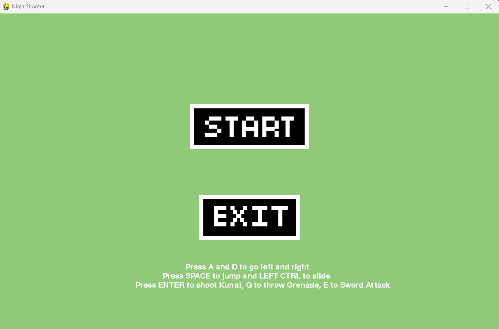
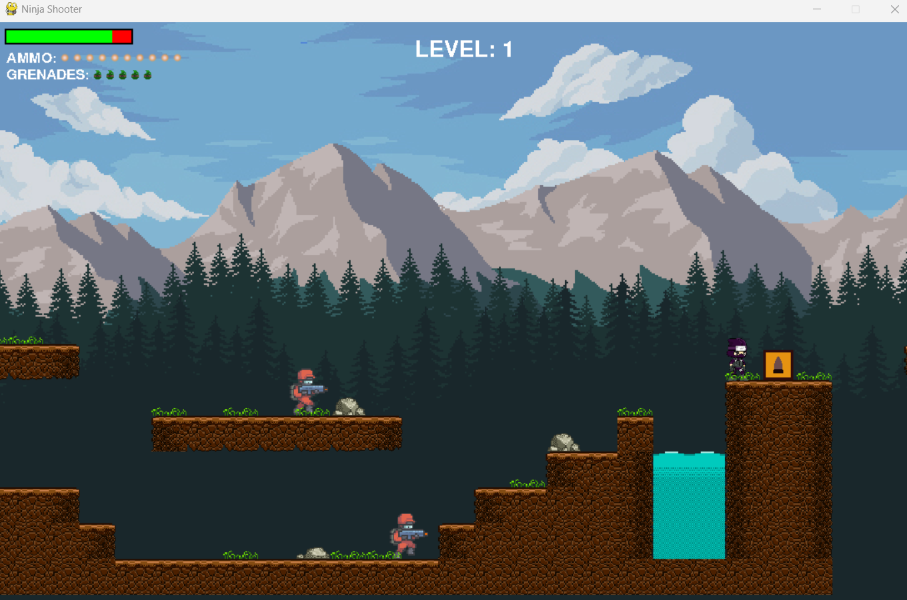
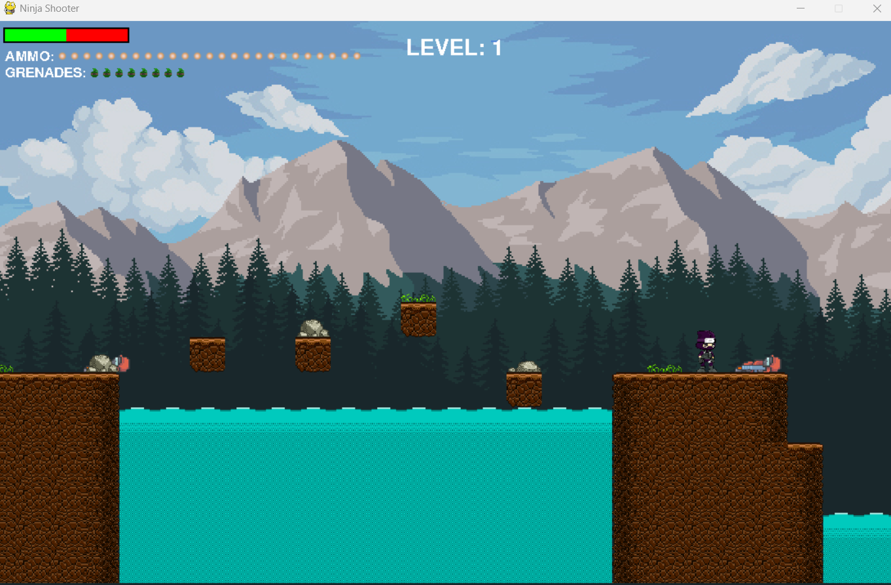
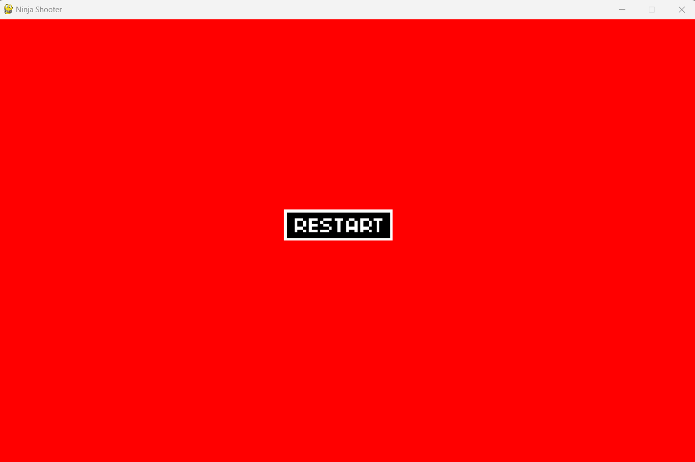

# Ninja Shooter

## Description

Ninja Shooter is a 2D shooter game developed using Pygame. In this game, you control a ninja character and your objective is to defeat enemies using various weapons and abilities.

## Features

- Intense action-packed gameplay
- 2 levels with increasing difficulty
- Wide range of weapons and power-ups to collect

## How to Run the Game

Navigate to the src folder and run the following command:
```
python main.py
```

Note: You must have Python and Pygame installed on your system to run the game.

## Controls

- Use the arrow keys to move the character
- Press the spacebar to jump
- Press the 'q' key to throw grenade
- Press Enter to shoot kunai
- Press 'e' to use the sword

## Screenshots




